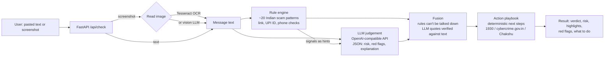

# Satark: an India-first AI scam checker

> **ForgeHacks 2026 · Track: AI + Cybersecurity**
> *"Build an AI-powered solution that helps people recognize, prevent, verify, or respond to scams, impersonation, and fraud enabled by AI or modern technologies."*

Paste a suspicious SMS, WhatsApp message or call script (or upload a screenshot). Satark tells you, in English, Hindi or Marathi:

1. **Is it a scam?** A verdict and a 0–100 risk score.
2. **Why?** The exact words that give it away, highlighted in the message.
3. **What do I do now?** Concrete next steps, including 1930 and cybercrime.gov.in if money has already gone.


> **For judges:** the live demo runs on Render's free tier, which goes to sleep when idle. **The first load may take
> about a minute** (the page shows "Waking up the server…"); after that it responds normally. Results appear
> instantly from the rules, and the AI check updates them a moment later.

---

## The problem

Indians lose thousands of crores a year to cyber fraud, and the scripts keep changing:
"digital arrest" video calls, fake KYC and electricity-cut SMSes, "like videos and earn" task jobs,
guaranteed-return trading groups, UPI "scan to receive cashback" tricks, banking malware sent as
`.apk` files, and AI voice clones of relatives asking for urgent money.

The people most targeted (parents, first-time smartphone users, students looking for work) rarely have
someone to ask *"is this real?"* at the moment it matters. Existing advice is spread across advisories
they never see.

**Target users:** anyone in India who receives a suspicious message, especially older and first-time
digital-payment users, and the family members who get forwarded these messages to check.

## How it works



**Two layers, on purpose:**

| Layer | What it catches | Why it's there |
|---|---|---|
| **Rule engine** (`backend/app/rules/`) | Known scripts (digital arrest, KYC block, task jobs, UPI PIN-to-receive, OTP requests, AnyDesk), look-alike bank domains (`sbi-kyc-update.xyz`), throwaway TLDs, URL shorteners, punycode, `.apk` links, official-sounding personal UPI IDs (`echallan.police@ybl`), foreign numbers posing as local | Instant, free, explainable, works offline and without an API key. Every flag carries the exact words it matched. |
| **LLM** (`backend/app/llm.py`) | New or reworded scripts, tone and context, messages with no obvious keyword. Writes the explanation in the user's language. | Scammers change wording faster than regexes. |

**Fusion rules (`backend/app/verdict.py`):**
- `risk = max(rule_score, 0.6 × llm_risk + 0.4 × rule_score)`. The LLM can raise risk but can't argue away hard evidence like a request for your UPI PIN.
- LLM "red flag" quotes are dropped unless they literally appear in the message, so hallucinated flags never reach the user.
- Next steps come from a fixed playbook (`backend/app/actions.py`), not the LLM, so safety advice is never invented.

## Tech stack

- **Backend:** Python, FastAPI, httpx
- **AI:** Gemini through its OpenAI-compatible endpoint (any OpenAI-compatible provider works). One retry on 500/503,
  a 12-second cap per request, an in-memory cache, and an optional **fallback on a different provider** (Groq in our
  setup). Gemini also reads screenshots. Optional Tesseract OCR for screenshots.
- **Frontend:** a single static page (vanilla HTML/CSS/JS, no build step), mobile-first, served by FastAPI. It shows
  the rules result instantly, then updates it in place when the AI answers. Hindi, Marathi, screen-reader and
  keyboard support.
- **Hosting:** Render (free web service) via `render.yaml`
- **Tests:** pytest (rules, API, LLM failure paths, vision, cache, fallback), a Node check of the page script, a
  labelled sample set, an eval script

## Results

Run `python scripts/eval.py` (rules only) or `python scripts/eval.py --llm` (both, side by side).

63 labelled messages in `samples/messages.json`, written for this project and modelled on public advisories:
35 scams in known scripts (English, Hinglish, Hindi, Marathi), 8 **rules-blind** scams that contain no keyword
the rules know, and 20 genuine messages.

| Group | n | Rules only | Rules + LLM |
|---|---|---|---|
| Known-script scams (caught) | 35 | 35 / 35 | 35 / 35 |
| **Rules-blind scams (caught)** | 8 | **0 / 8** | **8 / 8** |
| All scams (caught) | 43 | 35 / 43 (81%) | 43 / 43 (100%) |
| Genuine messages (false alarms) | 20 | 0 / 20 | 1 / 20 |

Rules give instant, explainable coverage of known scripts, and the LLM catches the new ones the rules have
never seen.

How to read this honestly:
- **The known-script row is in-sample.** I tuned the rules after the first run exposed 12 misses and 2 false
  alarms on these same samples, so 35/35 shows the fixes worked, not how it generalises. The rules-blind row is
  the fairer signal, because no rule was added for those messages (and a test keeps them at rule score 0).
- The genuine set is made of hard negatives: bank OTP and UPI alerts, a delivery OTP that says "share with the
  agent", college fee notices, a real RBI advisory that names AnyDesk, and real `amazon.in`, `onlinesbi.sbi` and
  `.gov.in` links.
- The one remaining false alarm is a friend asking for ₹500 on UPI, which the LLM rates "suspicious". It reads
  like a family-emergency scam without the pressure, so I left it rather than tune the prompt to one sample.
- LLM column: `gemini-3.1-flash-lite`, 62 of 63 samples got an AI score (61 from Gemini, 1 from the Groq fallback
  after two Gemini 503s, 1 timed out and fell back to rules). LLM output varies from run to run. A small,
  author-written set is a smoke test, not a benchmark.
- **Does the fallback hold up?** Re-running with the Gemini model deliberately broken, so that Groq
  (`qwen/qwen3.8-27b`) had to answer every sample: 63 of 63 AI-scored, **43/43 scams caught, 8/8 rules-blind, 0/20
  false alarms**. The numbers held, so a Gemini outage doesn't cost accuracy. The limit is throughput (about 8,000
  tokens a minute on Groq's free tier), not quality.

## Run it locally (Windows / PowerShell)

```powershell
git clone https://github.com/Dhwanitisshah/satark.git
cd satark
python -m venv .venv
.venv\Scripts\Activate.ps1
pip install -r requirements-dev.txt   # runtime + pytest + Pillow (the server alone needs only requirements.txt)
copy .env.example .env          # add LLM_API_KEY (optional, rules-only works without it)

cd backend
uvicorn app.main:app --reload   # open http://127.0.0.1:8000
```

Tests and checks (from the repo root):

```powershell
python -m pytest -q
python scripts\eval.py
pwsh scripts\smoke_test.ps1     # with the server running
```

## API

`POST /api/check` (multipart form)

| field | type | notes |
|---|---|---|
| `text` | string | the message (optional if `image` is sent) |
| `image` | file | PNG/JPG screenshot, max 5 MB |
| `lang` | `en` \| `hi` \| `mr` | language of the explanation |
| `ai` | bool, default `true` | `false` returns the rules-only verdict immediately (the UI calls this first, then again with `true`) |

Response (trimmed):

```json
{
  "verdict": "scam",
  "risk": 90,
  "headline": "This looks like a scam",
  "scam_type": "Fake 'SBI' look-alike website",
  "explanation": "…",
  "signals": [{"id": "url_lookalike", "label": "…", "why": "…", "evidence": "http://sbi-kyc-update.xyz/login"}],
  "llm_flags": [{"quote": "…", "why": "…"}],
  "highlights": ["YONO account will be blocked", "immediately", "http://sbi-kyc-update.xyz/login"],
  "actions": ["Don't click links, pay, or reply to this message.", "…"],
  "scores": {"rules": 90, "llm": 95},
  "ai_used": true,
  "ai_error": null,
  "ai_provider": "gemini"
}
```

`ai_provider` says which provider answered (`"gemini"`, `"groq"`, …), so a fallback is visible. If the AI call fails
(after the retry and the optional fallback), the rules still answer and `ai_error` is `"rate_limited"`,
`"unavailable"` or `"bad_response"`; the UI then shows "AI unavailable, rules-only result". A screenshot that can't
be read returns a friendly 503 rather than a false "no scam signs".

`GET /api/health` reports whether the LLM, vision, fallback and OCR are available.

## Deploy on Render (free)

`render.yaml` describes the service: root `backend/`, build `pip install -r ../requirements.txt`, start
`uvicorn app.main:app --host 0.0.0.0 --port $PORT`, health check `/api/health`. Use **New → Blueprint** in the
Render dashboard and point it at this repo; Render asks for the two secrets.

Environment variables (values are in `.env.example`; **never commit real keys**):

| Variable | Purpose |
|---|---|
| `LLM_API_KEY` | **secret.** Gemini API key (primary provider) |
| `LLM_BASE_URL`, `LLM_MODEL` | primary provider endpoint and model |
| `LLM_VISION` | `true` so the model can read screenshots (there is no Tesseract on Render) |
| `LLM_FALLBACK_API_KEY` | **secret.** key for the fallback provider |
| `LLM_FALLBACK_BASE_URL`, `LLM_FALLBACK_MODEL` | fallback provider endpoint and model (text-only) |
| `LLM_TOTAL_TIMEOUT`, `LLM_TOTAL_TIMEOUT_VISION` | cap on all AI work per request, in seconds (text check / screenshot-only) |
| `LLM_TIMEOUT`, `LLM_MAX_TOKENS` | optional: per-call timeout and reply budget |
| `CORS_ORIGINS` | allowed origins (`*` by default) |

The free tier sleeps after about 15 minutes without traffic and takes up to a minute to wake. The page pings
`/api/health` on load, so it is usually awake by the time someone has pasted a message, and it says
"Waking up the server…" while it waits.

Check a deployment with `pwsh scripts\smoke_test.ps1 -Base https://<your-service>.onrender.com`.

## Real-world impact

- **Moment of need:** the check takes seconds, before the click or payment, not after.
- **Explains, doesn't just label:** users learn the patterns (e.g. *"a UPI PIN only ever sends money"*), so the next scam is easier to spot without the tool.
- **Routes to real help:** when money is already gone, it points straight to 1930, cybercrime.gov.in and Sanchar Saathi Chakshu.
- **Works without AI too:** the rule layer runs with no API key, so it can ship cheaply or on-device.

## Limitations & honesty

- A "low risk" result is not a guarantee. The UI says so.
- Rules are tuned to Indian scam patterns and English, Hindi and Hinglish keywords; other languages lean on the LLM.
- **Privacy:** when the AI layer is on, the text (or screenshot) you check is sent to the LLM provider. On Gemini's
  free tier, Google may use that content to improve its models. Satark itself stores nothing, and the UI asks users
  not to paste personal details such as account numbers. If the fallback provider is configured, a message the
  primary couldn't answer is sent to that provider instead (text only, never the screenshot). The rules-only mode
  (no API key) sends nothing anywhere.
- **Free-tier limits:** the AI layer depends on free quotas. Gemini returns the occasional 503 or 429, and the
  Groq fallback allows about 8,000 tokens a minute, roughly six checks a minute. When both are unavailable the
  rules answer alone, and repeated checks of the same message are served from an in-memory cache.
- **Hindi and Marathi:** the headline, section titles and page text are translated, and the AI writes its
  explanation in the chosen language. The "what to do now" steps are a fixed English playbook for now. Translations
  have not been reviewed by a native speaker.
- **Screenshots** are read by the vision model, so they need the AI to be available.

## Roadmap

- WhatsApp / Android share-target, so users can forward a message straight to Satark
- Voice-note check for cloned-voice "relative in trouble" calls
- Community-reported numbers and domains, cross-checked against Chakshu
- On-device rules-only mode as a lightweight Android app

## Project structure

```
backend/app/
  main.py          FastAPI app + static frontend
  rules/engine.py  scam patterns, link / UPI / phone checks, scoring
  rules/domains.py brand tokens, official domains, TLD + UPI handle lists
  llm.py           OpenAI-compatible LLM call: retry, cross-provider fallback, 12s cap, cache, JSON parsing
  verdict.py       fusion of rules + LLM, hallucination guard
  actions.py       deterministic next-step playbook
  ocr.py           optional Tesseract OCR
frontend/index.html     the whole UI (two-stage result, hi/mr, accessibility)
samples/messages.json   63 labelled test messages (35 scams, 8 rules-blind, 20 genuine)
samples/screenshots/    generated test screenshots
scripts/eval.py         grouped catch-rate / false-alarm report, rules-only vs rules + LLM
scripts/make_screenshots.py  renders the test screenshots
scripts/smoke_test.ps1  end-to-end check against a running server
tests/                  pytest suite + ui_flow.js (Node check of the page script)
render.yaml             Render Blueprint
requirements.txt        what the server needs; requirements-dev.txt adds pytest and Pillow
```
