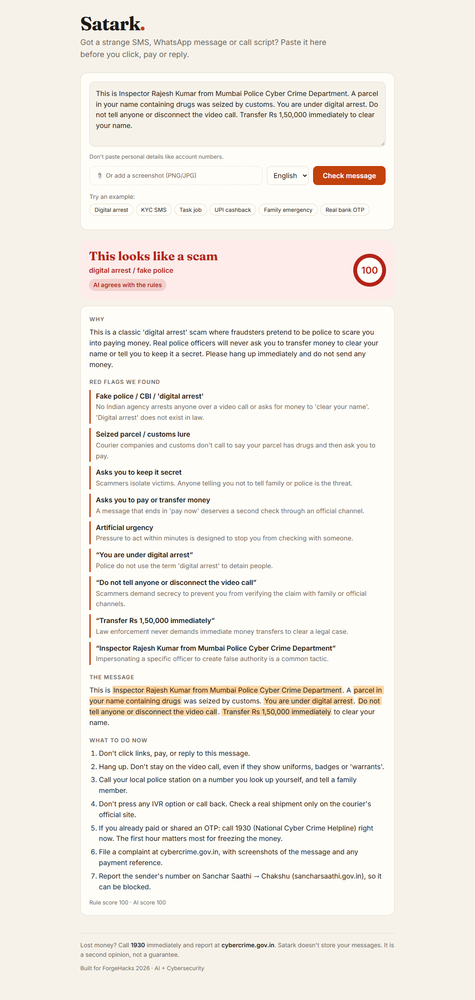
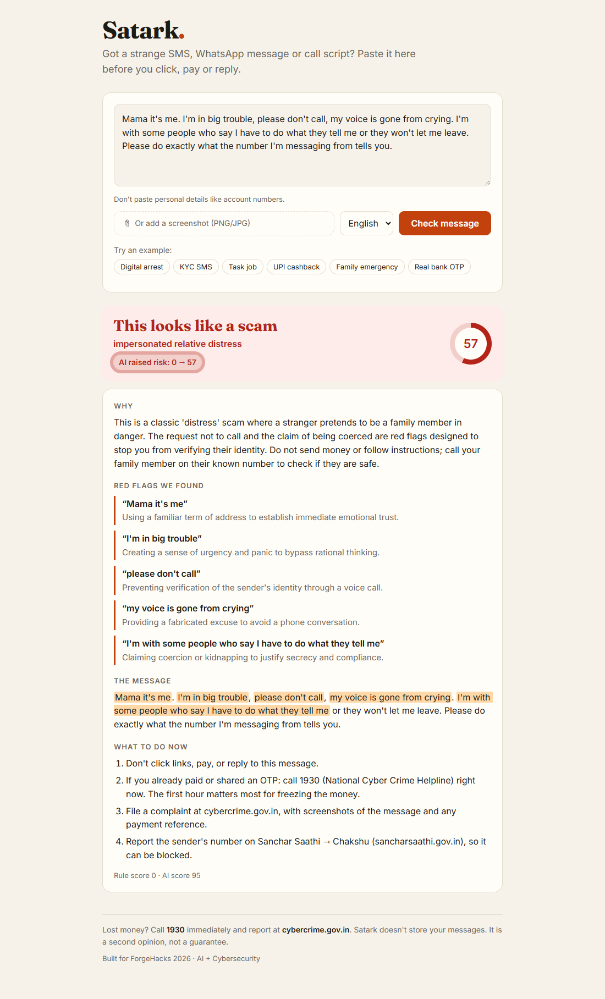
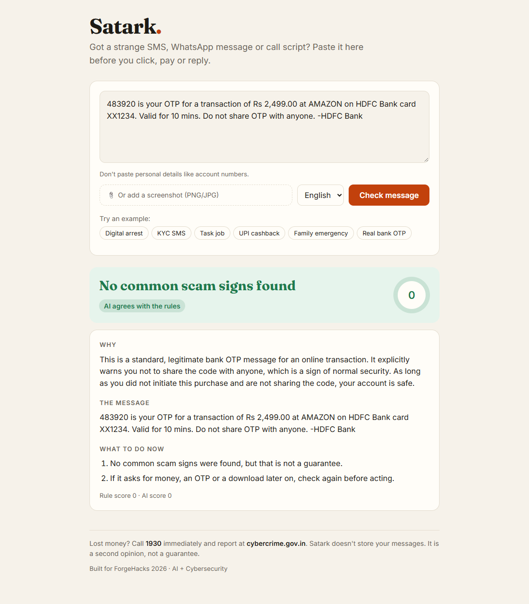
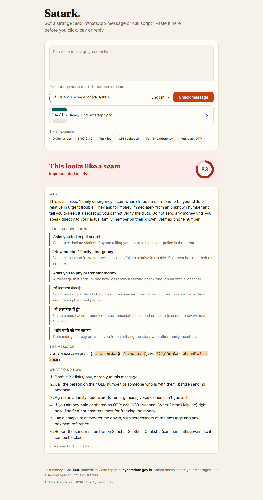
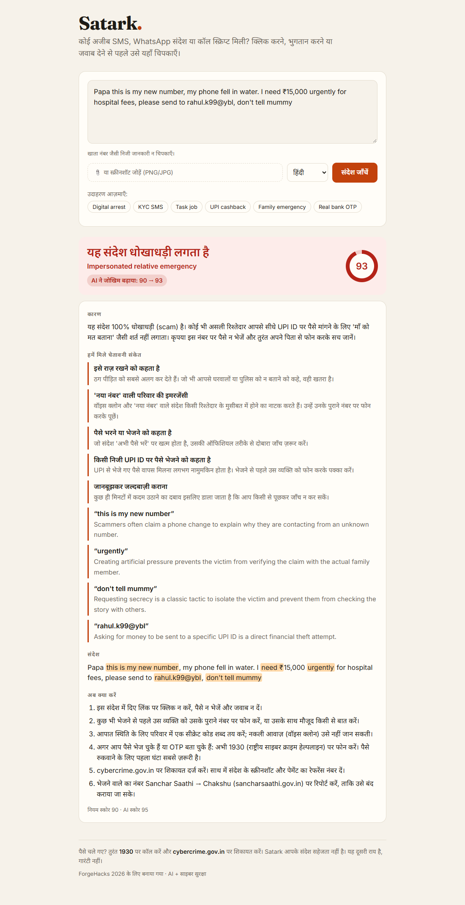
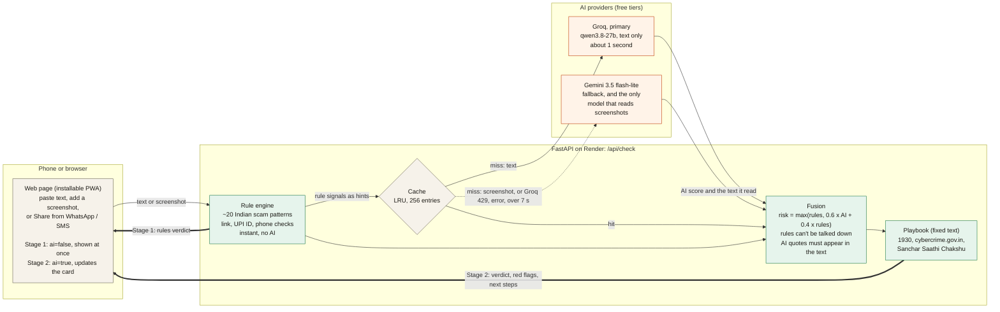

# Satark: an India-first AI scam checker

> **ForgeHacks 2026 · Track: AI + Cybersecurity**
> *"Build an AI-powered solution that helps people recognize, prevent, verify, or respond to scams, impersonation, and fraud enabled by AI or modern technologies."*

Paste a suspicious SMS, WhatsApp message or call script (or upload a screenshot). Satark tells you, in English, Hindi or Marathi:

1. **Is it a scam?** A verdict and a 0–100 risk score.
2. **Why?** The exact words that give it away, highlighted in the message.
3. **What do I do now?** Concrete next steps, including 1930 and cybercrime.gov.in if money has already gone.


> **Live demo: https://satark-1tnt.onrender.com**  ·  **Demo video:** _coming soon_ <!-- TODO: paste the YouTube link here once uploaded -->
>
> It runs on Render's free tier, which sleeps when idle: **the first load can take about a minute** (the page
> shows "Waking up the server…"). After that it answers in about a second.

## Try it in 30 seconds

1. Open **https://satark-1tnt.onrender.com** (cold-start note above). Click the **Digital arrest** example. The
   rules verdict appears at once; a moment later the AI updates the same card.
2. Click **Real bank OTP**. It stays **low risk**: Satark doesn't cry wolf.
3. Paste a scam that has no scam keywords, the kind rules can't see:
   ```
   Mama it's me. I'm in big trouble, please don't call, my voice is gone from crying. I'm with some people who say I have to do what they tell me or they won't let me leave. Please do exactly what the number I'm messaging from tells you.
   ```
   The rules score it **0**, then the AI raises it and it becomes a scam (a badge reads, for example, "AI raised risk: 0 → 57").
4. Add a **screenshot** instead of text: try [samples/screenshots/family-hindi-whatsapp.png](samples/screenshots/family-hindi-whatsapp.png)
   (a Hindi WhatsApp "papa, send money" message). Satark reads it and checks it.
5. Switch the language to **हिंदी** or **मराठी**: the page, headline, red flags, the "what to do now" steps and the AI's
   explanation all change language (1930, cybercrime.gov.in, OTP, UPI and PIN stay as written).
6. On Android, install it and use **Share → Satark** from WhatsApp ([how](#install-it-and-share-messages-straight-to-it-android)).

## What it looks like

Captured from the live site, real AI answers. Phone-width versions are in [docs/screenshots/](docs/screenshots/).

| Known scam: digital arrest | Rules see nothing, the AI catches it | Genuine bank OTP: stays low | Screenshot in, verdict out |
|---|---|---|---|
|  |  |  |  |

Before and after the AI answers on the middle case: [rules only](docs/screenshots/desktop-rules-blind-1-rules-only.png)
(0, "No common scam signs found") → [with the AI](docs/screenshots/desktop-rules-blind-2-ai-raised-risk.png) (scam, risk 57).
The upload example is a generated test image of a WhatsApp chat.

**In Hindi** (language set to हिंदी; [desktop](docs/screenshots/desktop-hindi.png), [phone](docs/screenshots/mobile-hindi.png)):



Slides for the video and Devpost: [docs/results.png](docs/results.png) and [docs/architecture.png](docs/architecture.png).

---

## The problem

Losses that citizens reported on the National Cybercrime Reporting Portal rose from **₹2,290 crore in 2022** to
**₹7,465 crore in 2023** and **₹22,846 crore in 2024**, about ten times in two years (Ministry of Home Affairs, I4C
data, [Lok Sabha Unstarred Question 432, answered 2 December 2025](https://www.mha.gov.in/MHA1/Par2017/pdfs/par2025-pdfs/LS02122025/432.pdf)).
The scripts keep changing:
"digital arrest" video calls, fake KYC and electricity-cut SMSes, "like videos and earn" task jobs,
guaranteed-return trading groups, UPI "scan to receive cashback" tricks, banking malware sent as
`.apk` files, and AI voice clones of relatives asking for urgent money.

The people most targeted (parents, first-time smartphone users, students looking for work) rarely have
someone to ask *"is this real?"* at the moment it matters. Existing advice is spread across advisories
they never see.

**Target users:** anyone in India who receives a suspicious message, especially older and first-time
digital-payment users, and the family members who get forwarded these messages to check.

## How it works



**Two layers, on purpose:**

| Layer | What it catches | Why it's there |
|---|---|---|
| **Rule engine** (`backend/app/rules/`) | Known scripts (digital arrest, KYC block, task jobs, UPI PIN-to-receive, OTP requests, AnyDesk), look-alike bank domains (`sbi-kyc-update.xyz`), throwaway TLDs, URL shorteners, punycode, `.apk` links, official-sounding personal UPI IDs (`echallan.police@ybl`), foreign numbers posing as local | Instant, free, explainable, works offline and without an API key. Every flag carries the exact words it matched. |
| **LLM** (`backend/app/llm.py`) | New or reworded scripts, tone and context, messages with no obvious keyword. Writes the explanation in the user's language. | Scammers change wording faster than regexes. |

**Fusion rules (`backend/app/verdict.py`):**
- `risk = max(rule_score, 0.6 × llm_risk + 0.4 × rule_score)`. The LLM can raise risk but can't argue away hard evidence like a request for your UPI PIN.
- LLM "red flag" quotes are dropped unless they literally appear in the message, so hallucinated flags never reach the user.
- Next steps come from a fixed playbook (`backend/app/actions.py`), not the LLM, so safety advice is never invented.

## Tech stack

- **Backend:** Python, FastAPI, httpx
- **AI:** two models on two providers, both through OpenAI-compatible endpoints (any provider works). **Groq**
  (`qwen/qwen3.8-27b`, fast, text only) answers text checks first; **Gemini** (`gemini-3.5-flash-lite`) is the
  fallback and the only model that reads screenshots. A 429 from either goes straight to the other. One retry on
  500/503, a 12-second cap per request split into stages (the primary gets at most 7s, the fallback gets the rest),
  and an in-memory cache. Optional Tesseract OCR for screenshots.
- **Frontend:** a single static page (vanilla HTML/CSS/JS, no build step), mobile-first, served by FastAPI. It shows
  the rules result instantly, then updates it in place when the AI answers. Hindi, Marathi, screen-reader and
  keyboard support. Installable as a PWA with an Android Web Share Target (the service worker caches only the
  page shell).
- **Hosting:** Render (free web service) via `render.yaml`
- **Tests:** pytest (rules, API, LLM failure paths, vision, cache, fallback), a Node check of the page script, a
  labelled sample set, an eval script

## Results

Run `python scripts/eval.py` (rules only) or `python scripts/eval.py --llm` (both, side by side).

63 labelled messages in `samples/messages.json`, written for this project and modelled on public advisories:
35 scams in known scripts (English, Hinglish, Hindi, Marathi), 8 **rules-blind** scams that contain no keyword
the rules know, and 20 genuine messages.

| Group | n | Rules only | Rules + LLM |
|---|---|---|---|
| Known-script scams (caught) | 35 | 35 / 35 | 35 / 35 |
| **Rules-blind scams (caught)** | 8 | **0 / 8** | **8 / 8** |
| All scams (caught) | 43 | 35 / 43 (81%) | 43 / 43 (100%) |
| Genuine messages (false alarms) | 20 | 0 / 20 | 0 / 20 |

Rules give instant, explainable coverage of known scripts, and the LLM catches the new ones the rules have
never seen. (The same table as a slide: [docs/results.png](docs/results.png).)

How to read this honestly:
- **The known-script row is in-sample.** I tuned the rules after the first run exposed 12 misses and 2 false
  alarms on these same samples, so 35/35 shows the fixes worked, not how it generalises. The rules-blind row is
  the fairer signal, because no rule was added for those messages (and a test keeps them at rule score 0).
- The genuine set is made of hard negatives: bank OTP and UPI alerts, a delivery OTP that says "share with the
  agent", college fee notices, a real RBI advisory that names AnyDesk, and real `amazon.in`, `onlinesbi.sbi` and
  `.gov.in` links.
- **The false-alarm cell depends on which model answers.** With Groq answering, which is the normal case, none of the
  20 genuine messages is flagged. If the Gemini fallback answers instead (when Groq is rate-limited or down), it flags
  one: a friend asking for ₹500 on UPI, which it scores 51. That message reads like a family-emergency scam without the
  pressure, so I left it rather than tune the prompt to one sample.
- **LLM column: the production run of 2026-10-08.** Exactly the deployed setup (Groq `qwen/qwen3.8-27b` primary, Gemini
  `gemini-3.5-flash-lite` fallback, default 12s / 7s time caps, 12s between samples): **63 of 63 samples got an AI
  score. Groq answered 61, Gemini answered 2** (after Groq rate limits). Result: 43/43 scams, 8/8 rules-blind, 0/20
  false alarms. The rules-blind scams land at 51–57, only just over the 50 "scam" line (the AI rates them 85–95, and
  counts for 60% of the score), so they are caught with a thin margin. LLM output varies from run to run, and a small,
  author-written set is a smoke test, not a benchmark.
- **A prompt change I rejected.** I asked the AI to write its per-quote reasons and scam-type label in the chosen
  language. In the same eval, Groq then rated a genuine electricity-bill SMS as a scam (AI score 95, final 57), a
  false alarm the old prompt never produced, so I reverted the change. Those reasons stay in English for now.
- **Earlier, on 2026-10-06, with the production time caps and staged budgets** (12s per request, primary limited to 7s): 63 of 63 AI-scored,
  **43/43 scams, 8/8 rules-blind, 0/20 false alarms**. Gemini exceeded its 7s budget on 37 of the 63 samples that
  day, and Groq answered each of them within the same request. Before the staged budgets, a slow Gemini used up the
  whole cap and those checks fell back to rules-only.
- **Does the fallback hold up?** Re-running with the Gemini model deliberately broken, so that Groq
  (`qwen/qwen3.8-27b`) had to answer every sample: 63 of 63 AI-scored, **43/43 scams caught, 8/8 rules-blind, 0/20
  false alarms**. The numbers held, so a Gemini outage doesn't cost accuracy. The limit is throughput (about 8,000
  tokens a minute on Groq's free tier), not quality.
- **And the other way round?** With Groq deliberately broken so that Gemini (`gemini-3.5-flash-lite`) answered every
  sample: 63 of 63 AI-scored with no failures, **43/43 scams, 8/8 rules-blind, 1/20 false alarms**. The one false alarm
  is the friend-₹500 message, which Gemini rates as a scam (51) where Groq doesn't. It only matters when Gemini
  answers a text check, which is when Groq is rate-limited or down.

### Live speed

Measured against the deployed service (Render free tier, Oregon) on 2026-10-07 with
`python scripts/measure_live.py <url>`: 10 text checks and 3 screenshot checks, each made unique so the cache
couldn't help, spaced 12 seconds apart to stay under Groq's free-tier limit. Times are what a person waits, in
seconds, from sending the request to getting the full result (the rules-only result on the page is instant).

| | n | median | worst | answered by |
|---|---|---|---|---|
| **Text check** | 10 | **1.05s** | 2.0s | Groq 10 of 10 |
| **Screenshot check** | 3 | **7.6s** | 10.0s | Gemini 3 of 3 |

All 13 checks got an AI answer. For comparison, the same measurement before the speed work: text 1.0s median but one
check took 15.4s (a Groq rate limit, then a slow Gemini), and screenshots took 16.0s median, 18.6s worst, with one
of three failing. The three changes behind the improvement: one shared keep-alive HTTP client (building a client
per check cost about 0.3–0.5s here and much more on a throttled free-tier CPU), a warm-up request at startup, and
`gemini-3.5-flash-lite` for screenshots (the earlier `gemini-3.1-flash-lite` took 15–18s for the same image).

Read these numbers with care. They are a small sample on one day, and screenshot time varies a lot: the same model read
a screenshot in about 2.5s in a test from a laptop and took 4.5–10s from Render. The text checks were spaced out; a
burst of more than about 6 checks a minute hits Groq's token limit, and those checks go to Gemini, which is slower.

## Install it and share messages straight to it (Android)

Satark is an installable web app (PWA) with a **Web Share Target**, so a message can go from WhatsApp or SMS into
Satark in two taps instead of copy and paste.

1. On an Android phone, open https://satark-1tnt.onrender.com in Chrome and choose **⋮ → Install app** (or *Add to
   Home screen*).
2. In WhatsApp, Messages or any app, use a message's **Share** action and pick **Satark**. The text is dropped
   into the box and checked at once: rules first, then the AI update.

No phone to hand? Open `https://satark-1tnt.onrender.com/?text=Your%20SBI%20account%20is%20blocked%2C%20update%20KYC%20at%20http%3A%2F%2Fsbi-kyc.xyz`
in any browser. That is exactly the address the share sheet opens (`/?title=…&text=…&url=…`), and it fills the box
and runs the check. Afterwards the message is removed from the address bar, so it isn't kept in history and a
refresh won't send it again.

What the service worker (`frontend/sw.js`) does and doesn't do: it caches only the page shell (the page, manifest
and icons), so the installed app opens even on a poor connection. API calls and every non-GET request go straight
to the network; **no verdict and no message is ever cached** (tests check this). On desktop the site looks and
behaves exactly as before. I compared the old and new versions: identical API output on all 63 samples, and
pixel-identical desktop screenshots.

Honest note: the install and share-sheet flow was verified in headless Edge (Chrome reports no installability
errors, the share URL runs a check, the shell opens offline), not on a physical Android phone. Regenerate the icons
with `python scripts/make_icons.py`.

## Run it locally (Windows / PowerShell)

```powershell
git clone https://github.com/Dhwanitisshah/satark.git
cd satark
python -m venv .venv
.venv\Scripts\Activate.ps1
pip install -r requirements-dev.txt   # runtime + pytest + Pillow (the server alone needs only requirements.txt)
copy .env.example .env          # add LLM_API_KEY (optional, rules-only works without it)

cd backend
uvicorn app.main:app --reload   # open http://127.0.0.1:8000
```

Tests and checks (from the repo root):

```powershell
python -m pytest -q
python scripts\eval.py
pwsh scripts\smoke_test.ps1     # with the server running
```

## API

`POST /api/check` (multipart form)

| field | type | notes |
|---|---|---|
| `text` | string | the message (optional if `image` is sent) |
| `image` | file | PNG/JPG screenshot, max 5 MB |
| `lang` | `en` \| `hi` \| `mr` | language of the explanation |
| `ai` | bool, default `true` | `false` returns the rules-only verdict immediately (the UI calls this first, then again with `true`) |

Response (trimmed):

```json
{
  "verdict": "scam",
  "risk": 90,
  "headline": "This looks like a scam",
  "scam_type": "Fake 'SBI' look-alike website",
  "explanation": "…",
  "signals": [{"id": "url_lookalike", "label": "…", "why": "…", "evidence": "http://sbi-kyc-update.xyz/login"}],
  "llm_flags": [{"quote": "…", "why": "…"}],
  "highlights": ["YONO account will be blocked", "immediately", "http://sbi-kyc-update.xyz/login"],
  "actions": ["Don't click links, pay, or reply to this message.", "…"],
  "scores": {"rules": 90, "llm": 95},
  "ai_used": true,
  "ai_error": null,
  "ai_provider": "gemini"
}
```

`ai_provider` says which provider answered (`"groq"`, `"gemini"`, …), so a fallback is visible. If the AI call fails
(after the retry and the optional fallback), the rules still answer and `ai_error` is `"rate_limited"`,
`"unavailable"` or `"bad_response"`; the UI then shows "AI unavailable, rules-only result". A screenshot that can't
be read returns a friendly 503 rather than a false "no scam signs".

Two more fields help when something is slow or down, but they are **debug-only**: they appear in the response only
when the server runs with `SATARK_DEBUG=true`. `ai_timing` says how the answering call went (connect, TLS and
first-byte milliseconds, whether the connection was reused, token counts, `cached: true` for a repeat). When the AI
fails, `ai_attempts` lists each failed attempt with its provider, model, HTTP status (or error name such as
`timeout`) and duration, for example `401` for a rejected API key or `429` for a rate limit. Neither contains a key or
any message text. A normal response keeps only `ai_provider` and the coarse `ai_error`. The same details are
**always** written to the server log (`LLM call ok`, `LLM call failed`, `LLM gave no answer after N attempt(s)`),
whether or not the flag is set.

`GET /api/health` reports whether the LLM, vision, fallback and OCR are available.

To measure a deployment, run `python scripts/measure_live.py <url>` (10 text and 3 screenshot checks by default, paced
for Groq's rate limit): it prints the median and worst times and which provider answered each check.

## Deploy on Render (free)

`render.yaml` describes the service: root `backend/`, build `pip install -r ../requirements.txt`, start
`uvicorn app.main:app --host 0.0.0.0 --port $PORT`, health check `/api/health`. Use **New → Blueprint** in the
Render dashboard and point it at this repo; Render asks for the two secrets.

Environment variables (values are in `.env.example`; **never commit real keys**):

| Variable | Purpose |
|---|---|
| `LLM_API_KEY` | **secret.** the **primary** model's key (Groq) |
| `LLM_BASE_URL`, `LLM_MODEL` | primary provider endpoint and model (Groq, a text model) |
| `LLM_VISION` | can the primary read screenshots? `false` for Groq's text models |
| `LLM_FALLBACK_API_KEY` | **secret.** the **fallback** model's key (Gemini) |
| `LLM_FALLBACK_BASE_URL`, `LLM_FALLBACK_MODEL` | fallback provider endpoint and model (Gemini) |
| `LLM_FALLBACK_VISION` | `true`: the fallback reads screenshots (there is no Tesseract on Render) |
| `LLM_TOTAL_TIMEOUT`, `LLM_TOTAL_TIMEOUT_VISION` | cap on all AI work per request, in seconds (text check / screenshot-only) |
| `LLM_PRIMARY_TIMEOUT` | most the primary may use while a fallback is waiting (default 7s); the fallback gets the rest of the cap |
| `LLM_TIMEOUT`, `LLM_MAX_TOKENS` | optional: per-call timeout and reply budget |
| `SATARK_DEBUG` | optional, off by default: `true` adds `ai_timing` / `ai_attempts` to API responses (a plain `DEBUG` is ignored) |
| `CORS_ORIGINS` | allowed origins (`*` by default) |

The free tier sleeps after about 15 minutes without traffic and takes up to a minute to wake. The page pings
`/api/health` on load, so it is usually awake by the time someone has pasted a message, and it says
"Waking up the server…" while it waits.

Check a deployment with `pwsh scripts\smoke_test.ps1 -Base https://<your-service>.onrender.com`.

## Real-world impact

- **Moment of need:** the check takes seconds, before the click or payment, not after.
- **Explains, doesn't just label:** users learn the patterns (e.g. *"a UPI PIN only ever sends money"*), so the next scam is easier to spot without the tool.
- **Routes to real help:** when money is already gone, it points straight to 1930, cybercrime.gov.in and Sanchar Saathi Chakshu.
- **Works without AI too:** the rule layer runs with no API key, so it can ship cheaply or on-device.

## Limitations & honesty

- A "low risk" result is not a guarantee. The UI says so.
- Rules are tuned to Indian scam patterns and English, Hindi and Hinglish keywords; other languages lean on the LLM.
- **Privacy:** when the AI layer is on, the text you check is sent to Groq, and to Google (Gemini) if Groq can't
  answer. A screenshot goes only to Google, because only Gemini can read images. On Gemini's free tier, Google may
  use that content to improve its models. Satark itself stores nothing, and the UI asks users not to paste personal
  details such as account numbers. The rules-only mode (no API key) sends nothing anywhere.
- **Free-tier limits:** the AI layer depends on free quotas. Groq (the primary) allows about 8,000 tokens a minute,
  roughly six checks a minute; beyond that a 429 sends the check to Gemini, which is slower (often 5–10s) and
  returns the occasional 503 or 429. When both are unavailable the rules answer alone, and repeated checks of the
  same message are served from an in-memory cache.
- **Hindi and Marathi:** the page text, headline, rule-based red flags and the whole "what to do now" playbook are
  translated, and the AI writes its overall explanation in the chosen language. Names people must recognise stay
  as written: 1930, cybercrime.gov.in, Sanchar Saathi / Chakshu, OTP, UPI, PIN, KYC. Two gaps: the AI's one-line reason
  under each *quoted* phrase is still in English (its quotes must stay verbatim, and the prompt only asks for the
  overall explanation in your language; a prompt change to translate them was tried and rejected, see Results), and the AI's
  scam-type label is not translated. The translations were
  written for this project and reviewed by me before release; they have not had an independent native-speaker
  review. `python scripts/check_translations_live.py` checks a deployment (every step and signal has Devanagari
  text, the names above survive, evidence is unchanged).
- **Screenshots** are read by Gemini (the only vision model configured), so they need Gemini to be available.
  Their speed varies a lot (about 2.5s from a laptop, 4.5–10s from Render), and Gemini now and then returns a 503 or
  429, in which case the check says so instead of guessing.
- **One known false alarm, when Gemini answers.** A friend asking for ₹500 on UPI gets flagged by the Gemini fallback
  (it scored 51); Groq leaves it alone, and with Groq answering, the eval has 0 false alarms in 20. I left it rather
  than tune the prompt to one sample. It only appears when Gemini answers a text check, which is when Groq is
  rate-limited or down.
- **Gemini fallback variance.** Gemini is slower and less steady than Groq, and its scores differ a little from
  Groq's. Rules still answer first and the AI can only raise a score, so a Gemini wobble can't hide a known scam.
- **Cold start.** Render's free tier sleeps after about 15 minutes idle; the first load can take about a minute.
- **The Android install and share-sheet flow** was checked in headless Edge, not on a physical phone, and iPhone
  Safari has no Web Share Target.

## Roadmap

- Share target for iPhone (Safari has no Web Share Target; it needs a Shortcut or a native app)
- Voice-note check for cloned-voice "relative in trouble" calls
- Community-reported numbers and domains, cross-checked against Chakshu
- On-device rules-only mode as a lightweight Android app

## Project structure

```
backend/app/
  main.py          FastAPI app + static frontend
  rules/engine.py  scam patterns, link / UPI / phone checks, scoring
  rules/domains.py brand tokens, official domains, TLD + UPI handle lists
  llm.py           OpenAI-compatible LLM call: retry, cross-provider fallback, 12s cap, cache, JSON parsing
  verdict.py       fusion of rules + LLM, hallucination guard
  actions.py       deterministic next-step playbook
  ocr.py           optional Tesseract OCR
frontend/index.html     the whole UI (two-stage result, hi/mr, accessibility)
frontend/manifest.json  PWA manifest incl. the Web Share Target; sw.js is the service worker; icons/ are generated
samples/messages.json   63 labelled test messages (35 scams, 8 rules-blind, 20 genuine)
samples/screenshots/    generated test screenshots
scripts/eval.py         grouped catch-rate / false-alarm report, rules-only vs rules + LLM
scripts/make_screenshots.py  renders the test screenshots
scripts/make_icons.py   renders the PWA icons
scripts/smoke_test.ps1  end-to-end check against a running server
tests/                  pytest suite + ui_flow.js (Node check of the page script)
render.yaml             Render Blueprint
requirements.txt        what the server needs; requirements-dev.txt adds pytest and Pillow
```
