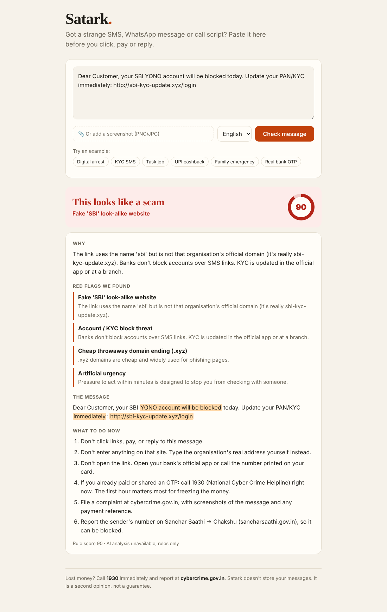
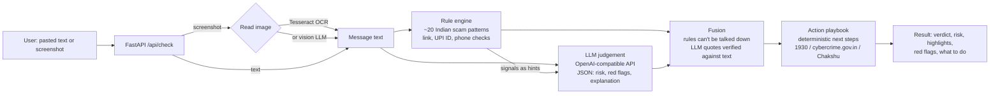

# Satark: an India-first AI scam checker

> **ForgeHacks 2026 · Track: AI + Cybersecurity**
> *"Build an AI-powered solution that helps people recognize, prevent, verify, or respond to scams, impersonation, and fraud enabled by AI or modern technologies."*

Paste a suspicious SMS, WhatsApp message or call script (or upload a screenshot). Satark tells you, in English, Hindi or Marathi:

1. **Is it a scam?** A verdict and a 0–100 risk score.
2. **Why?** The exact words that give it away, highlighted in the message.
3. **What do I do now?** Concrete next steps, including 1930 and cybercrime.gov.in if money has already gone.



---

## The problem

Indians lose thousands of crores a year to cyber fraud, and the scripts keep changing:
"digital arrest" video calls, fake KYC and electricity-cut SMSes, "like videos and earn" task jobs,
guaranteed-return trading groups, UPI "scan to receive cashback" tricks, banking malware sent as
`.apk` files, and AI voice clones of relatives asking for urgent money.

The people most targeted (parents, first-time smartphone users, students looking for work) rarely have
someone to ask *"is this real?"* at the moment it matters. Existing advice is spread across advisories
they never see.

**Target users:** anyone in India who receives a suspicious message, especially older and first-time
digital-payment users, and the family members who get forwarded these messages to check.

## How it works



**Two layers, on purpose:**

| Layer | What it catches | Why it's there |
|---|---|---|
| **Rule engine** (`backend/app/rules/`) | Known scripts (digital arrest, KYC block, task jobs, UPI PIN-to-receive, OTP requests, AnyDesk), look-alike bank domains (`sbi-kyc-update.xyz`), throwaway TLDs, URL shorteners, punycode, `.apk` links, official-sounding personal UPI IDs (`echallan.police@ybl`), foreign numbers posing as local | Instant, free, explainable, works offline and without an API key. Every flag carries the exact words it matched. |
| **LLM** (`backend/app/llm.py`) | New or reworded scripts, tone and context, messages with no obvious keyword. Writes the explanation in the user's language. | Scammers change wording faster than regexes. |

**Fusion rules (`backend/app/verdict.py`):**
- `risk = max(rule_score, 0.6 × llm_risk + 0.4 × rule_score)`. The LLM can raise risk but can't argue away hard evidence like a request for your UPI PIN.
- LLM "red flag" quotes are dropped unless they literally appear in the message, so hallucinated flags never reach the user.
- Next steps come from a fixed playbook (`backend/app/actions.py`), not the LLM, so safety advice is never invented.

## Tech stack

- **Backend:** Python, FastAPI, httpx
- **AI:** any OpenAI-compatible chat model (Featherless open-source models via the ForgeHacks perk, or Gemini for screenshot reading). Optional Tesseract OCR for screenshots.
- **Frontend:** a single static page (vanilla HTML/CSS/JS), mobile-first, served by FastAPI
- **Tests:** pytest (rule engine + API), a labelled sample set, an eval script

## Results

Run `python scripts/eval.py` (rules only) or `python scripts/eval.py --llm`.

| Setup | Scams caught | False alarms on genuine messages |
|---|---|---|
| Rules only (14 labelled samples) | 10 / 10 | 0 / 4 |
| Rules + LLM | *fill in* | *fill in* |

The genuine set deliberately includes hard negatives: a real HDFC OTP alert ("Do not share OTP"), a
real SBI warning that mentions AnyDesk, and a real `amazon.in` link.

## Run it locally (Windows / PowerShell)

```powershell
git clone https://github.com/Dhwanitisshah/satark.git
cd satark
python -m venv .venv
.venv\Scripts\Activate.ps1
pip install -r requirements.txt
copy .env.example .env          # add LLM_API_KEY (optional, rules-only works without it)

cd backend
uvicorn app.main:app --reload   # open http://127.0.0.1:8000
```

Tests and checks (from the repo root):

```powershell
python -m pytest -q
python scripts\eval.py
pwsh scripts\smoke_test.ps1     # with the server running
```

## API

`POST /api/check` (multipart form)

| field | type | notes |
|---|---|---|
| `text` | string | the message (optional if `image` is sent) |
| `image` | file | PNG/JPG screenshot, max 5 MB |
| `lang` | `en` \| `hi` \| `mr` | language of the explanation |

Response (trimmed):

```json
{
  "verdict": "scam",
  "risk": 90,
  "headline": "This looks like a scam",
  "scam_type": "Fake 'SBI' look-alike website",
  "explanation": "…",
  "signals": [{"id": "url_lookalike", "label": "…", "why": "…", "evidence": "http://sbi-kyc-update.xyz/login"}],
  "llm_flags": [{"quote": "…", "why": "…"}],
  "highlights": ["YONO account will be blocked", "immediately", "http://sbi-kyc-update.xyz/login"],
  "actions": ["Don't click links, pay, or reply to this message.", "…"],
  "scores": {"rules": 90, "llm": 95},
  "ai_used": true
}
```

`GET /api/health` reports whether the LLM, vision and OCR are available.

## Real-world impact

- **Moment of need:** the check takes seconds, before the click or payment, not after.
- **Explains, doesn't just label:** users learn the patterns (e.g. *"a UPI PIN only ever sends money"*), so the next scam is easier to spot without the tool.
- **Routes to real help:** when money is already gone, it points straight to 1930, cybercrime.gov.in and Sanchar Saathi Chakshu.
- **Works without AI too:** the rule layer runs with no API key, so it can ship cheaply or on-device.

## Limitations & honesty

- A "low risk" result is not a guarantee. The UI says so.
- Rules are tuned to Indian scam patterns and English, Hindi and Hinglish keywords; other languages lean on the LLM.
- The text you check is sent to the configured LLM provider. Satark itself stores nothing.

## Roadmap

- WhatsApp / Android share-target, so users can forward a message straight to Satark
- Voice-note check for cloned-voice "relative in trouble" calls
- Community-reported numbers and domains, cross-checked against Chakshu
- On-device rules-only mode as a lightweight Android app

## Project structure

```
backend/app/
  main.py          FastAPI app + static frontend
  rules/engine.py  scam patterns, link / UPI / phone checks, scoring
  rules/domains.py brand tokens, official domains, TLD + UPI handle lists
  llm.py           OpenAI-compatible LLM call + JSON parsing
  verdict.py       fusion of rules + LLM, hallucination guard
  actions.py       deterministic next-step playbook
  ocr.py           optional Tesseract OCR
frontend/index.html
samples/messages.json   labelled test messages
scripts/eval.py         catch-rate / false-alarm report
scripts/smoke_test.ps1  end-to-end check against a running server
tests/                  pytest suite
```
